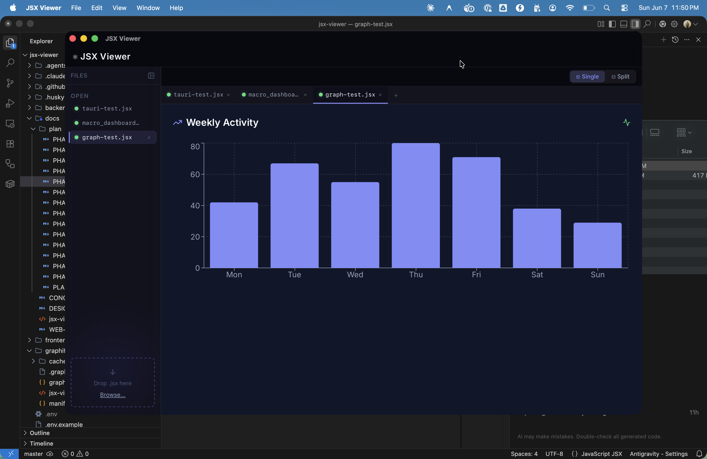
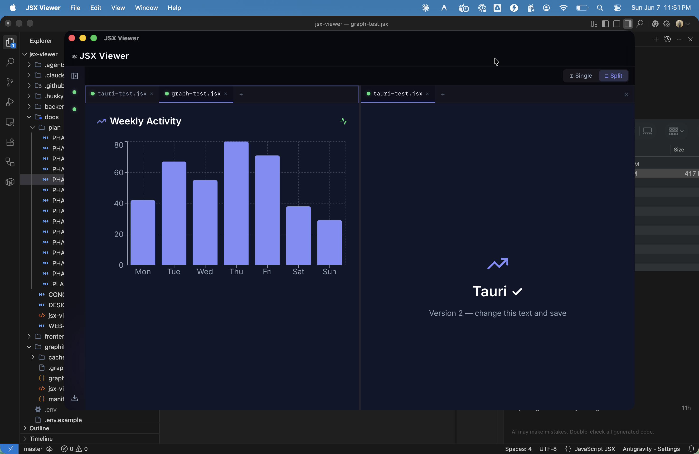

# JSX Viewer

A native macOS app for previewing `.jsx` and `.tsx` React components instantly. Drag a file in, see it render — no `npm install`, no dev server, no browser needed.

React, Tailwind CSS, Recharts, Lucide, and shadcn/ui components are all pre-bundled. Open any component file and it just works.





---

## Features

- **Instant preview** — drag `.jsx` / `.tsx` from Finder, renders immediately
- **Split pane** — view two components side by side with a resizable divider
- **Multi-tab** — open multiple files, switch between them per pane
- **File sidebar** — collapsible file list, resizable, keyboard shortcut `⌘B`
- **Live reload** — file watcher detects saves and re-renders automatically (Tauri mode)
- **Finder integration** — appears in "Open With"; optional double-click default handler
- **Pre-bundled libraries** — no imports to resolve; unknown imports show a placeholder instead of crashing

---

## Supported Libraries

| Import | Library |
|---|---|
| `react`, `react-dom` | React 18 |
| `lucide-react` | Lucide icons (all icons) |
| `recharts` | Recharts charts |
| `tailwindcss` (via CDN) | Tailwind CSS |
| `@radix-ui/react-slot` | Radix slot primitive |

Unknown imports render as a visible placeholder `Unknown: {specifier}` — the app never crashes on a missing library.

---

## Getting Started

### Requirements

| Tool | Version |
|---|---|
| macOS | 12 Monterey or later |
| Rust | stable (via [rustup](https://rustup.rs)) |
| Node.js | 20+ |
| Xcode Command Line Tools | latest (`xcode-select --install`) |

### Run in dev mode

```bash
git clone https://github.com/your-handle/jsx-viewer.git
cd jsx-viewer
make dev
```

A native window opens with hot-reload. Frontend changes reflect instantly (Vite HMR); Rust changes recompile automatically (~10–30s).

### Build a `.dmg`

```bash
make app
```

Output: `frontend/src-tauri/target/release/bundle/dmg/JSX Viewer_0.1.0_x64.dmg`

Install the `.dmg`, then right-click any `.jsx` file in Finder → **Open With → JSX Viewer**.

---

## Make Workflows

All commands run from the project root.

| Command | What it does |
|---|---|
| `make dev` | Native Tauri window with hot-reload — use for all day-to-day development |
| `make app` | Full production build → `.dmg` |
| `make open` | Build `.dmg` and open the output folder in Finder |
| `make check` | TypeScript check + all tests + lint (run before committing) |
| `make install` | `npm install` only |
| `make clean` | Delete `dist/` and `target/` for a clean rebuild |

> `make dev` covers everything except Finder file associations, the first-launch "Set as Default" prompt, and DMG install behaviour — those require a bundled `.app` in `/Applications`.

---

## Project Structure

```
jsx-viewer/
├── frontend/
│   ├── src/                  # React + TypeScript UI
│   │   ├── components/       # Sidebar, Viewer, Pane, Preview, …
│   │   ├── hooks/            # useTabs, usePanes, useSidebar, …
│   │   └── lib/              # Transpiler, renderer, adapters, library registry
│   └── src-tauri/            # Rust backend (Tauri v2)
│       └── src/
│           ├── commands.rs   # read_file, watch_file, file associations, …
│           └── lib.rs        # App entry, RunEvent::Opened handler
├── backend/                  # Express server — web dev mode only
├── docs/                     # Design docs, phase plans, screenshots
├── Makefile
└── docker-compose.yml        # Web dev mode only
```

---

## Architecture

JSX Viewer has two runtime modes that share the same React frontend:

**Tauri (native app)** — the primary mode. The Rust backend reads files via `read_file`, watches for changes with `notify`, and forwards OS file-open events (`RunEvent::Opened`) to the frontend. No network requests, no sandbox restrictions.

**Web (Docker)** — a convenience mode for frontend-only development without Rust. The Express backend proxies file reads and watches via WebSocket. File content is cached in `localStorage` so open tabs survive page refreshes.

The frontend selects the right adapter at runtime based on `__TAURI_INTERNALS__`.

---

## Web Dev Mode (Docker)

For contributors who don't have the Rust toolchain set up:

**Prerequisites:** Docker Desktop

```bash
docker-compose up
```

Open [http://localhost:5173](http://localhost:5173). File watching uses the browser File System Access API — grant permission when prompted (Chrome/Edge only; not available in Safari).

> `docker-compose.yml` and `backend/` are web-dev-only scaffolding. They are not included in the native app.

---

## Code Signing (distribution)

Unsigned builds work for personal local use. To distribute via GitHub Releases, macOS Gatekeeper requires code signing and notarization:

1. Enroll in the [Apple Developer Program](https://developer.apple.com/programs/)
2. Export environment variables before building:
   ```bash
   export APPLE_SIGNING_IDENTITY="Developer ID Application: Your Name (TEAMID)"
   export APPLE_ID="you@example.com"
   export APPLE_PASSWORD="app-specific-password"
   export APPLE_TEAM_ID="TEAMID"
   ```
3. `make app` — Tauri handles signing and notarization automatically

> The "Set as Default" handler (`LSSetDefaultRoleHandlerForContentType`) also requires a signed build installed in `/Applications` to take effect.

---

## Known Limitations

- **"Set as Default"** requires a signed build in `/Applications`
- **Web mode file watching** requires the File System Access API (Chrome/Edge only)
- **Network requests / Node.js builtins** — components that call `fetch` or import Node core modules won't render
- **Large components** with many dependencies may be slow to transpile on first render

---

## Contributing

```bash
# Run all checks before opening a PR
make check

# Rust checks (requires cargo in PATH)
cd frontend/src-tauri && cargo clippy -- -D warnings && cargo test
```

All checks must pass: TypeScript (zero errors), Vitest (71 tests), ESLint (zero warnings), Rust clippy (zero warnings).
