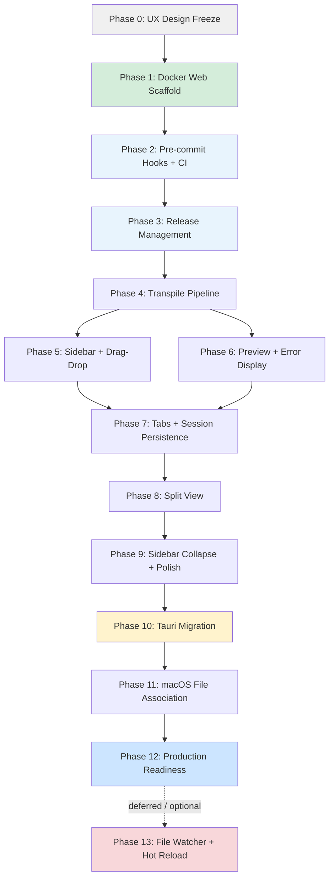

# JSX Viewer — Vibe Coding Master Plan

> Generated from: DESIGN.md + user refinement (web-first before Tauri)  
> Stack: TypeScript / React 18 + Vite / Node.js + Express / Docker → Tauri v2 (Phase 10+)  
> Test framework: Vitest (frontend) + Jest + Supertest (backend)  
> Total phases: 14 (0–13)

## What We're Building

JSX Viewer renders Claude-generated JSX artifacts locally — drag a `.jsx` file onto the
sidebar, it transpiles and renders immediately with React, Tailwind, Recharts, Lucide,
and shadcn/ui stubs all pre-bundled. File watching means edits in any text editor
auto-reload the preview. Ships as a macOS `.dmg` (Tauri), but the full UI is first
built and validated as a Docker-backed web app.

## Web-First Strategy

> **User refinement:** Build the complete app as a local web server (Docker) first.
> Validate UX design and all features in the browser. Then port to Tauri macOS app.

**Why this works:** The React frontend is identical in both targets. Only the file I/O
layer differs:

| Layer | Web phase (Phases 1–9) | Tauri phase (Phases 10–12) |
|-------|----------------------|--------------------------|
| File read | `POST /api/open` → Node.js `fs.readFile` | `read_file` Tauri IPC command |
| File watch | Node.js `chokidar` + WebSocket (Phase 13) | `notify` crate + Tauri event (Phase 13) |
| Drag-drop | HTML5 File API (content only) | HTML5 File API → Tauri path |
| Session | `localStorage` | `localStorage` (unchanged) |

Frontend hooks (`useFileWatcher`, file read calls) are abstracted behind an adapter
interface so swapping the backend is surgical.

---

## Phase Summary

| # | Phase Name | Complexity | Parallel With |
|---|-----------|------------|---------------|
| 0 | UX Design Freeze | Low | — |
| 1 | Docker Web Scaffold | Low | — |
| 2 | Pre-commit Hooks + CI | Low | — |
| 3 | Release Management | Low | — |
| 4 | Transpile Pipeline | Medium | — |
| 5 | Sidebar + Drag-Drop | Medium | — |
| 6 | Preview + Error Display | Medium | 5 |
| 7 | Tabs + Session Persistence | Medium | — |
| 8 | Split View | Medium | — |
| 9 | Sidebar Collapse + Polish | Low | — |
| 10 | Tauri Migration | High | — |
| 11 | macOS File Association | Medium | — |
| 12 | Production Readiness | Low | — |
| 13 | File Watcher + Hot Reload | Medium | — (deferred, post-ship) |

---

## Dependency & Parallelism Map

> Phases 5 and 6 can run in parallel after Phase 4.  
> Phase 13 is deferred — app ships after Phase 12, hot reload added post-ship.

---

## Status Dashboard

> **Agent:** Update this table as phases complete.

| Phase | Name | Status |
|-------|------|--------|
| 0 | UX Design Freeze | ✅ COMPLETE |
| 1 | Docker Web Scaffold | ✅ COMPLETE |
| 2 | Pre-commit Hooks + CI | ✅ COMPLETE |
| 3 | Release Management | ✅ COMPLETE |
| 4 | Transpile Pipeline | 🔲 NOT_STARTED |
| 5 | Sidebar + Drag-Drop | 🔲 NOT_STARTED |
| 6 | Preview + Error Display | 🔲 NOT_STARTED |
| 7 | Tabs + Session Persistence | 🔲 NOT_STARTED |
| 8 | Split View | 🔲 NOT_STARTED |
| 9 | Sidebar Collapse + Polish | 🔲 NOT_STARTED |
| 10 | Tauri Migration | 🔲 NOT_STARTED |
| 11 | macOS File Association | 🔲 NOT_STARTED |
| 12 | Production Readiness | 🔲 NOT_STARTED |
| 13 | File Watcher + Hot Reload | ⏸️ DEFERRED |

---

## Phase Files

- [Phase 0 — UX Design Freeze](./PHASE-0.md)
- [Phase 1 — Docker Web Scaffold](./PHASE-1.md)
- [Phase 2 — Pre-commit Hooks + CI](./PHASE-2.md)
- [Phase 3 — Release Management](./PHASE-3.md)
- [Phase 4 — Transpile Pipeline](./PHASE-4.md)
- [Phase 5 — Sidebar + Drag-Drop](./PHASE-5.md)
- [Phase 6 — Preview + Error Display](./PHASE-6.md)
- [Phase 7 — Tabs + Session Persistence](./PHASE-7.md)
- [Phase 8 — Split View](./PHASE-8.md)
- [Phase 9 — Sidebar Collapse + Polish](./PHASE-9.md)
- [Phase 10 — Tauri Migration](./PHASE-10.md)
- [Phase 11 — macOS File Association](./PHASE-11.md)
- [Phase 12 — Production Readiness](./PHASE-12.md)
- [Phase 13 — File Watcher + Hot Reload (Deferred)](./PHASE-13.md)

---

## Agent Instructions

1. Always start with Phase 0 before writing any code.
2. Read DESIGN.md in full before beginning each phase.
3. Each phase must reach its Done Gate before the next starts, unless the Mermaid map marks phases parallel.
4. Update Status Dashboard above and the Status field in each PHASE file as you progress.
5. If a phase reveals new requirements, update DESIGN.md first and note the change in the phase's Notes section.
6. The I/O adapter abstraction (see Phase 4 Notes) is critical — do not let file I/O calls scatter across components.
7. Phases 1–9 target the browser (localhost:5173). Do not install or reference Tauri packages until Phase 10.
8. End every phase with one conventional commit: `feat(phase-N): <description>`. This is what release-please (Phase 3) uses to build the changelog. Do not create multiple commits per phase on `main`.
9. Phase 13 (File Watcher) is intentionally deferred and may become a toggleable setting. Do not implement file watching in earlier phases — use the IOAdapter stub pattern.
